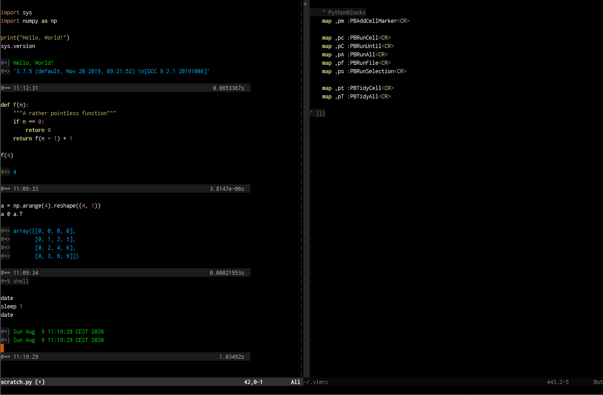

# Pythonblocks

Harness the power of interactive Python execution right inside Neovim.



## Features

 * Edit your (interactive) python code with the full power of NeoVIM
 * Interactively run individuall cells/blocks of code or any visual selection
 * Smooth transition from "trying stuff out" to a proper application (its a python file at all stages)
 * Receive stdout, stderr and expression values in nvim as specially highlighted comments (your python file stays valid)
 * Environment is independent process from Neovims python
 * Support for magic commands (custom functions to interpret cell contents)
 * Built-in reporting of cell execution duration & last execution time

## Design decisions

 * We try to keep it on a sweet spot between simple and powerful
 * No additional dependencies apart from neovim, python and pynvim
 * Pythonblocks will not mess with your keybindings as its hard to predict what would or wouldnt cause conflicts with something else.
   See below for some keybinding suggestions.

## Limitations

 * No inline tables, plots, etc...
 * No connection to jupyter notebook, no .ipynb support

## Comparison to similar approaches

(empty cells mean "no")

|                                               | ipython console mode | jupyter notebook (browser) | jupyter-vim | vimpyter | pythonblocks |
| ---                                           | ---                  | ---                        | ---         | ---      | ---          |
| Edit your python code in NeoVIM               | only functions       |                            | yes         | yes      | yes          |
| Save your python code as .py files            | only functions       |                            | yes         |          | yes          |
| Navigation/overview of your code              |                      | yes                        | yes         | yes      | yes          |
| Decent handling of multiline blocks           |                      | yes                        | yes         | yes      | yes          |
| Do not require a separate window & refreshing | yes                  | yes                        |             |          | yes          |
| Inline pictures & tables                      |                      | yes                        |             |          |              |
| Magic %commands                               | yes                  | yes                        | not tested  | not tested | yes        |

## Development stage

Currently, pythonblocks is is in an early/experimental stage.
We believe its already quite useful in some situations but it has not yet received intensive testing.
Behavior / interface can still change and documentation is in between nonexistant and incomplete at this stage.

Issue reports and PRs are generally welcome.

## Installation & Usage

Install via your favorite plugin manager eg

```Vim script
Plug 'Droggelbecher/vim-pythonblocks'
```

Set up some keybindings

```Vim script
" Insert an empty ell marker (eg. #==) at current linke
map ,pm :PBAddCellMarker<CR>

" Run current cell, all cells until cursor position or all cells
map ,pc :PBRunCell<CR>
map ,pC :PBRunUntil<CR>
map ,pA :PBRunAll<CR>

" Run whole file with :py3file
map ,pf :PBRunFile<CR>

" Run visual selection, does not update any cell markers
map ,ps :PBRunSelection<CR>

" Clean up lines created for expression return values, stdout, stderr etc.
map ,pt :PBTidyCell<CR>
map ,pT :PBTidyAll<CR>
```

Now create an empty python file and  enter some code you want to evaluate:

```python
print("Hello, World!")
3 + 4
```
After pressing `,pc` we get the expression return value:

```python

print("Hello, World!")
3 + 4

#=| Hello, World!
#=> 7

```


## Configuration

Configure options (with defaults):

```Vim script
" All lines pythonblocks-specific lines will start with this
let g:pythonblocks#marker_prefix = '#=' 

" Cells will be delimited by "#==" (marker_prefix + marker_cell)
let g:pythonblocks#marker_cell = '='

" Expression values will be prefixed with "#=>"
let g:pythonblocks#marker_value = '>'

" stdout/stderr with #=| and #=! respectively
let g:pythonblocks#marker_stdout = '|'
let g:pythonblocks#marker_stderr = '!'

" Expand markers:
" After successfull cell execution the below marker line (if exists)
" will be modified to include some additional information.
" Template variables you can use:
" `dt` - Execution time in seconds
" `value` - Value of last expression in block
" `value_unless_none` - dito, but if None expand to empty string
" `time` - time after cell execution
let g:pythonblocks#expand_marker = 1
let g:pythonblocks#marker_template = '{time:%H:%M:%S} {dt:>64.6}s  '

" What information to actually put into your buffer (potentially in addition to marker expansion)
" Value of last expression; 0, 1, or 'not_none'
let g:pythonblocks#insert_return = 'not_none'
let g:pythonblocks#insert_stdout = 1
let g:pythonblocks#insert_stderr = 1

" Show the visual selection for this long (+ how long the actual execution takes).
" This gives some nice visual feedback on whats happening especially when executing multiple cells.
let g:pythonblocks#visual_delay = '200m'
```

